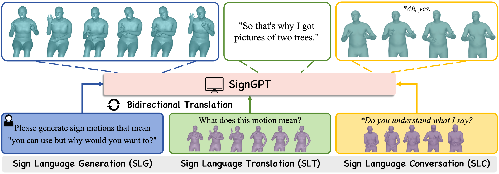

# SignGPT

Official research code for **SignGPT: Toward LLM-Mediated Sign Language
Interaction through Gloss-Free Translation and Generation**.

SignGPT learns a discrete sign-motion vocabulary and unifies sign-language
generation (text to motion, SLG) and translation (motion to text, SLT) in a
single dataset-specific model. The repository also includes the one-turn
sign-to-sign interaction pipeline used in the paper.

<p align="center">
  
</p>

A central SignGPT model connects translation and generation. On the left, a
text instruction is converted into a sequence of signing avatars. In the
middle, an input signing sequence is translated into text. On the right, a
signed question is translated, answered in English, and converted into a
signed response, illustrating the one-turn response pipeline.

## Installation

Python 3.10 and a CUDA-enabled PyTorch installation are recommended.

```bash
git clone <repository-url> SignGPT
cd SignGPT

conda create -n signgpt python=3.10 -y
conda activate signgpt

# Install a PyTorch build compatible with your CUDA driver first.
pip install torch torchvision --index-url https://download.pytorch.org/whl/cu118
pip install -r requirements.txt
pip install -e .

# Text preprocessing needs one spaCy model per signed language:
python -m spacy download en_core_web_sm   # How2Sign (ASL)
python -m spacy download de_core_news_sm  # PHOENIX-2014T (DGS)
```

## 1. Acquiring the data and external assets

Both datasets require registration. Download the items below into a local
directory (the examples use `/data/signgpt_dataset/`, adjust as needed).

**How2Sign (ASL)**

| Item | Source |
|---|---|
| SMPL-X pose fits (`how2sign_pkls_cropTrue_shapeTrue.zip`, one merged pkl per clip) | request access at the [How2Sign pose form](https://docs.google.com/forms/d/e/1FAIpQLSc6xQJJMf_R4xJ1sIwDL6FBIYw4HbVVv_HUgCqeiguWX5XGPg/viewform) |
| Text annotations (`how2sign_realigned_{train,val,test}.csv`) | [How2Sign website](https://how2sign.github.io/#download) → *Text/Translation* |

**PHOENIX-2014T (DGS)**

| Item | Source |
|---|---|
| Text annotations (`PHOENIX-2014-T.{train,dev,test}.corpus.csv`) | [annotations folder](https://drive.google.com/drive/folders/1Z2zjOH5wvwT7x_F6IycWAN-nh2wgJOx1) |
| SMPL-X pose fits (one directory per clip with per-frame pkl chunks) | [SOKE](https://2000zrl.github.io/soke/) → *Data* → Phoenix |

**Shared assets**

| Item | Source | Layout |
|---|---|---|
| Llama-1B backbone | e.g. [`princeton-nlp/llama-1b`](https://huggingface.co/princeton-nlp/llama-1b) (any compatible checkpoint works) | `deps/llama-1b` |
| Instruction-tuned mediator LLM (only for `SLC_demo.py`) | e.g. [`princeton-nlp/llama-1b-instruction`](https://huggingface.co/princeton-nlp/llama-1b-instruction) | `deps/llama-1b-instruction` |
| GloVe word vectors + HumanML3D vocabulary (`our_vab_*`) | [HumanML3D release](https://github.com/EricGuo5513/HumanML3D) | `deps/glove/` |
| SMPL-X body models | https://smpl-x.de (register, download the neutral model) | `deps/smpl_models/smplx/SMPLX_NEUTRAL.pkl` |

```bash
mkdir -p deps
ln -s /path/to/llama-1b deps/llama-1b
ln -s /path/to/glove deps/glove
mkdir -p deps/smpl_models && cp -r /path/to/smplx_models/smplx deps/smpl_models/
```


## 2. Preprocessing

`preprocess/` contains the full pipeline that converts raw SMPL-X fits and
official CSVs into the training layout:

| Step | Input → Output |
|---|---|
| `step0_combine_pose_pkls` | per-frame pkl chunks → one merged pkl per clip |
| `step1_smplx_to_joints` | merged pkls → `[T, 73, 3]` joints (SMPL-X FK, neutral body, no global translation) |
| `step2_joints_to_features` | joints → skeleton-normalized `[T-1, 220]` features + recovered joints |
| `step3_concat_expression` | features ⊕ expression(10) → final `[T-1, 230]` features |
| `step4_cal_mean_std` | features → `mean/std_seperate_catexp_new_new.npy` |
| `step5_prepare_texts` | official CSVs → `TEXT_new_tackle/`, split files, prompt templates |

Dataset-specific notes:

* **How2Sign** — the pose archive is already merged per clip, so step 0 is
  not needed. Step 4 **must** use `--xz_velocity_std one` (the fits carry no
  global translation, so the root linear velocity is identically zero).
* **PHOENIX-2014T** — run step 0 first (clips are stored as per-frame pkl
  chunks); step 4 uses the default `--xz_velocity_std raw`.
* Step 2 retargets every clip to one reference skeleton. It defaults to the
  lexicographically first file of the input directory; process all splits in
  one call (or pass the same `--reference`) so statistics stay consistent.

After step 3/5 the training layout looks like:

```text
data/how2sign/                               # <- SIGNGPT_DATA_ROOT
├── train.txt  val.txt  test.txt  train_all.txt
├── template_pretrain.json
├── template_instructions.json
├── TEXT_new_tackle/<clip>.txt
└── all_73j_new_joint_vecs_onlylocal_cat_expression/<clip>.npy

deps/ASL/                                    # <- SIGNGPT_STATS_ROOT (How2Sign)
└── t2m/VQVAEV3_CB1024_CMT_H1024_NRES3/meta/
    ├── mean_seperate_catexp_new_new.npy
    └── std_seperate_catexp_new_new.npy
```

`deps/DGS/...` holds the PHOENIX-2014T statistics. See
[`preprocess/README.md`](preprocess/README.md) for the per-step commands and
file formats.

## 3. Configuration

Path configuration lives in `configs/assets.yaml` and is controlled through
environment variables:

| Variable | Purpose |
|---|---|
| `SIGNGPT_DATA_ROOT` | dataset root produced by preprocessing |
| `SIGNGPT_STATS_ROOT` | directory containing `t2m/VQVAEV3_CB1024_CMT_H1024_NRES3/meta/` |
| `SIGNGPT_LLM_PATH` | Llama-1B backbone (`./deps/llama-1b` by default) |
| `SIGNGPT_INSTRUCT_LLM_PATH` | instruction-tuned mediator LLM for `SLC_demo.py` |
| `WORD_VERTILIZER_PATH` | GloVe directory (`./deps/glove` by default) |
| `SIGNGPT_VAE_CKPT` | Stage-1 checkpoint used by Stage 2 / token extraction |
| `SIGNGPT_CODEBOOK_PATH` | codebook file used by Stage 2 |
| `SIGNGPT_CKPT` | full SignGPT checkpoint used by `demo.py` / `test.py` |
| `SIGNGPT_RUN_TAG` | suffix for experiment output names (keep concurrent runs separate) |

The main experiment files are:

| File | Purpose |
|---|---|
| `configs/config_h3d_stage1.yaml` | Train the partitioned hierarchical VQ tokenizer |
| `configs/config_h3d_stage2.yaml` | Joint SLG/SLT language-model training |
| `configs/config_h3d_stage3.yaml` | Optional instruction tuning |
| `configs/base_config_h3d_stage1.yaml` | Single-codebook baseline tokenizer |
| `configs/base_config_h3d_stage2.yaml` | Matched baseline LM training |

Before running a full-scale experiment, set its checkpoint fields to either
`null` or a local path. The checked-in configurations intentionally contain no
trained-weight paths.

## 4. Full-scale training


### Stage 1: sign-motion tokenizer

```bash
SIGNGPT_DATA_ROOT=/path/to/how2sign SIGNGPT_STATS_ROOT=deps/ASL \
python train.py --cfg configs/config_h3d_stage1.yaml --nodebug
```

### Prepare motion tokens for Stage 2

```bash
SIGNGPT_DATA_ROOT=/path/to/how2sign SIGNGPT_STATS_ROOT=deps/ASL \
python -m scripts.split_get_motion_code \
  --cfg configs/config_h3d_stage2.yaml \
  --vae_ckpt outputs/mgpt/<stage1-experiment>/checkpoints/last.ckpt

SIGNGPT_DATA_ROOT=/path/to/how2sign SIGNGPT_STATS_ROOT=deps/ASL \
python -m scripts.split_get_codebook_emb \
  --cfg configs/config_h3d_stage2.yaml \
  --vae_ckpt outputs/mgpt/<stage1-experiment>/checkpoints/last.ckpt
```

### Stage 2: unified SLG and SLT training

Set `TRAIN.PRETRAINED_VAE` and `DATASET.CODEBOOK_PARAMS_PATH` in the Stage 2
configuration (or export `SIGNGPT_VAE_CKPT` / `SIGNGPT_CODEBOOK_PATH`), then:

```bash
SIGNGPT_DATA_ROOT=/path/to/how2sign SIGNGPT_STATS_ROOT=deps/ASL \
python train.py --cfg configs/config_h3d_stage2.yaml --nodebug
```

### Stage 3: instruction tuning

Set the Stage 1 and Stage 2 checkpoint paths in
`configs/config_h3d_stage3.yaml`, then run:

```bash
python train.py --cfg configs/config_h3d_stage3.yaml --nodebug
```


## 5. Evaluation and inference

Set `TEST.CHECKPOINTS` to a local SignGPT checkpoint (or export
`SIGNGPT_CKPT` together with the dataset variables from section 3):

```bash
python test.py --cfg configs/config_h3d_stage2.yaml --task t2m
python test.py --cfg configs/config_h3d_stage2.yaml --task m2t
```

For file-based inference, create a UTF-8 text file with one item per line.
Text-to-motion entries contain plain text; motion-to-text entries use
`optional text # /path/to/motion.npy`:

```bash
SIGNGPT_DATA_ROOT=/path/to/how2sign SIGNGPT_STATS_ROOT=deps/ASL \
SIGNGPT_CODEBOOK_PATH=/path/to/signgpt_codebook.pt \
SIGNGPT_VAE_CKPT=outputs/mgpt/<stage1-experiment>/checkpoints/last.ckpt \
SIGNGPT_CKPT=outputs/mgpt/<stage2-experiment>/checkpoints/last.ckpt \
python demo.py --cfg configs/config_h3d_stage2.yaml \
    --task t2m --example /path/to/examples.txt --out_dir outputs/demo

# same command with --task m2t
```

`t2m` writes `<index>_out.npy` joint sequences; `m2t` writes the translated
sentences to `out.txt`. A standalone Stage-1
reconstruction report (MPJPE / PA-MPJPE / ACCEL / DTW on a split) is
available via:

```bash
python infer_vae.py --checkpoint outputs/mgpt/<stage1-experiment>/checkpoints/last.ckpt \
    --output_dir outputs/vae_reconstruction --cfg configs/config_h3d_stage1.yaml
```

### One-turn sign-to-sign pipeline

The optional pipeline composes SignGPT motion-to-text, an instruction-tuned
mediator LLM, and SignGPT text-to-motion without response-level training:

```bash
python SLC_demo.py \
  --cfg configs/config_h3d_stage2.yaml \
  --checkpoint /path/to/signgpt.ckpt \
  --mediator /path/to/llama-1b-instruction \
  --inputs /path/to/motion_paths.txt \
  --output_dir outputs/sign_conversation
```

## 6. Skeleton visualization

`vis_point.py` is a lightweight visualizer for motion arrays shaped
`[frames, joints, 3]` (a leading batch dimension is also accepted):

```bash
python vis_point.py /path/to/motion.npy --output outputs/motion.gif --fps 20
```

It uses an orthographic x-y projection and does not require SMPL, Blender, or
the training environment.

## Repository structure

```text
SignGPT/
├── assets/images/    # paper figures used by this README
├── configs/          # reproducible experiment configuration
├── mGPT/             # model, data, loss, metric, and utility modules
├── preprocess/       # data acquisition -> training-data pipeline (6 steps)
├── scripts/          # token/codebook preparation utilities
├── train.py          # training entry point
├── test.py           # evaluation entry point
├── demo.py           # SLG/SLT inference
├── infer_vae.py      # Stage-1 reconstruction report
├── SLC_demo.py       # one-turn sign-to-sign pipeline
└── vis_point.py      # lightweight skeleton visualizer
```

## Acknowledgments

This codebase builds on the MIT-licensed MotionGPT implementation and retains
its license notice.

## Citation

The archival citation will be added after publication.

## License

The source code is released under the [MIT License](LICENSE).
